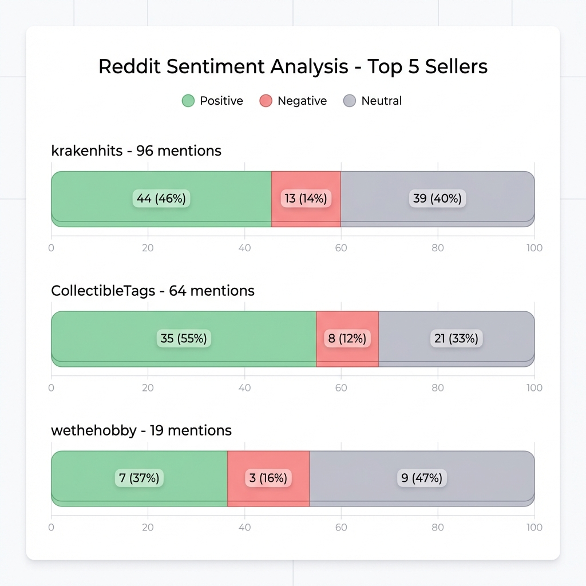
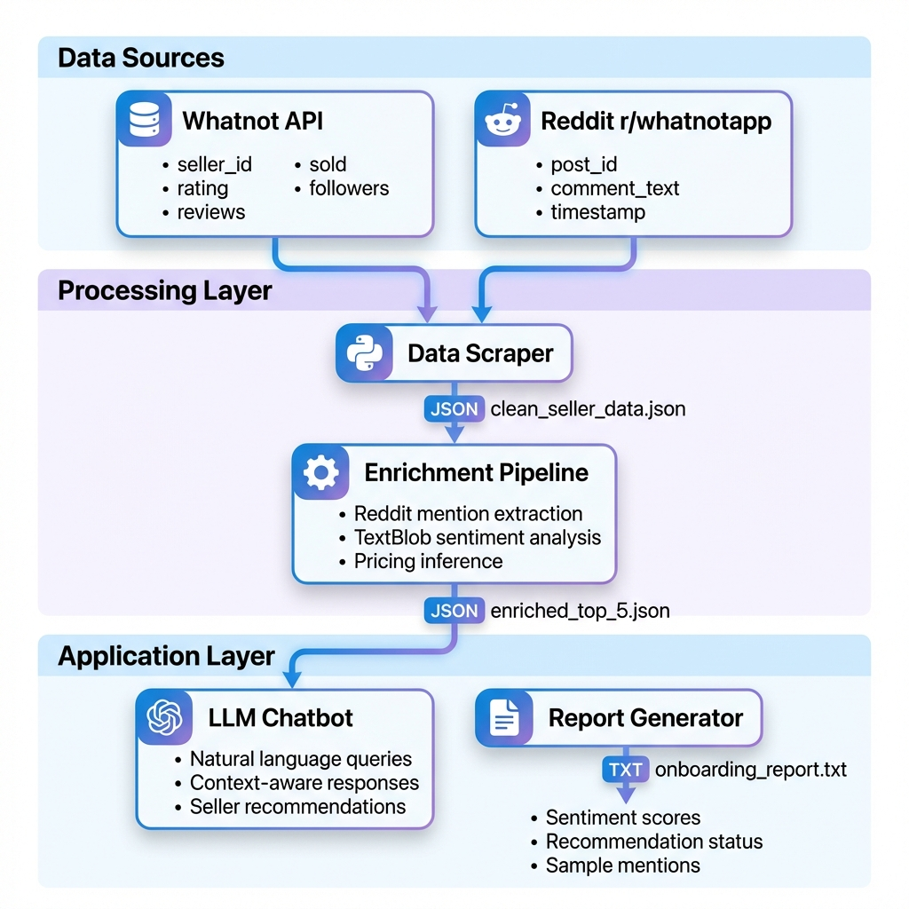

# Seller Analysis and Onboarding Chatbot

An automated system for evaluating Whatnot sellers using data analysis, sentiment tracking, and AI-powered recommendations. Built to streamline the seller onboarding process for live sales platforms.

**Platform:** Whatnot marketplace seller evaluation and onboarding automation.

## Business Problem

Operating an e-commerce platform with live sales requires onboarding high-quality sellers. Manual evaluation presents several challenges:

- **Time inefficiency** - Vetting each seller's profile, reviews, and reputation requires 2-3 hours per candidate
- **Inconsistent standards** - Multiple team members apply different evaluation criteria
- **Limited insights** - Community sentiment on Reddit and social media remains largely untapped
- **Scalability constraints** - Manual processes cannot handle hundreds of seller applications

**Solution:** This project automates seller evaluation, reducing research time from hours to minutes while providing data-driven recommendations based on quantitative metrics and community sentiment analysis.

## Project Highlights

### 🤖 AI-Powered Chatbot Interface

*Natural language query interface for instant seller recommendations with comprehensive metrics*

### 📊 Sentiment Analysis Dashboard

*Aggregated analysis of 40+ Reddit mentions per seller for community sentiment evaluation*

### 🔄 System Architecture

*End-to-end data pipeline: scraping, enrichment, analysis, and reporting*

## Core Functionality

The system performs five key operations:

1. **Data Collection** - Extracts seller metrics from Whatnot (ratings, sales volume, review counts)
2. **Community Analysis** - Scrapes r/whatnotapp for seller mentions and discussions
3. **Sentiment Classification** - Categorizes community feedback as positive, negative, or neutral
4. **Recommendation Engine** - Filters sellers based on predefined quality thresholds
5. **Interactive Queries** - Natural language interface for ad-hoc seller analysis

## Technical Implementation

### Prerequisites

- Python 3.14+
- OpenAI API key
- Internet connectivity

### Installation

```bash
git clone https://github.com/sathyatsn/seller-analysis-and-onboarding-chatbot.git
cd seller-analysis-and-onboarding-chatbot
pip3 install -r requirements.txt
```

### Configuration

Create `.env` file:
```
OPENAI_API_KEY=your_api_key_here
```

### Usage

**Interactive Chatbot:**
```bash
python3 seller_bot_llm.py
```

Query examples:
- "Show me the best 5 sellers"
- "What do people say about krakenhits on Reddit?"
- "Which sellers have the most sales?"

**Batch Report Generation:**
```bash
python3 enrich_sellers.py
python3 generate_report.py
cat onboarding_report.txt
```

## Evaluation Criteria

Sellers are assessed against the following thresholds:

- **Rating**: ≥ 4.9/5.0
- **Reviews**: ≥ 500
- **Sentiment**: Predominantly positive community feedback
- **Sales Volume**: Demonstrated transaction history

## Analysis Results

Top 5 sellers identified through automated evaluation:

1. **krakenhits** - 5.0 rating, 2.3M sales, 96 Reddit mentions
2. **CollectibleTags** - 5.0 rating, 186K sales, 64 Reddit mentions  
3. **wethehobby** - 5.0 rating, 392K sales, 19 Reddit mentions
4. **Gamecorps** - 5.0 rating, 274K sales
5. **drazcollects** - 5.0 rating, 117K sales

## System Architecture

**Data Pipeline:**
1. Web scraping of Whatnot seller profiles
2. Reddit mention extraction from r/whatnotapp
3. TextBlob-based sentiment classification
4. GPT-4 powered natural language interface
5. Automated report generation

**Technology Stack:**
- Python 3.14
- OpenAI GPT-4
- TextBlob (sentiment analysis)
- BeautifulSoup (web scraping)
- Reddit JSON API

- All data collection uses public APIs
# seller-analysis-and-onboarding-chatbot
